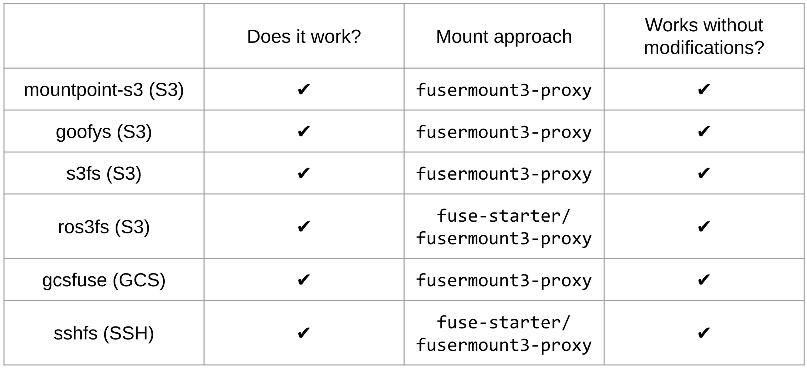
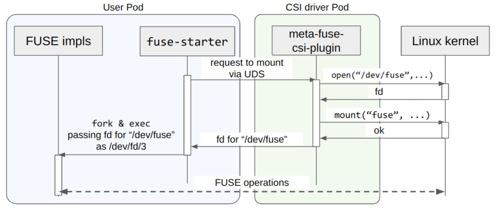
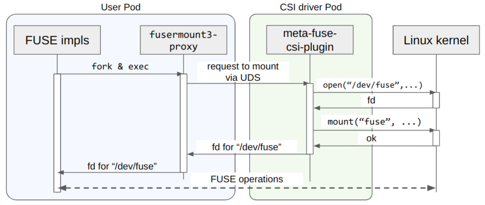

# meta-fuse-csi-plugin: A CSI Driver for All FUSE Implementations
[](https://github.com/pfnet-research/meta-fuse-csi-plugin/actions/workflows/e2e.yaml)

CSI Plugin to run and mount any FUSE implementations (e.g. [mountpoint-s3](https://github.com/awslabs/mountpoint-s3)) in Kubernetes pods without `privileged:true`.

Mounting FUSE implementations requires `CAP_SYS_ADMIN`.
However, assigning `CAP_SYS_ADMIN` to normal pods is not recommended in terms of security.
meta-fuse-csi-plugin enables pods to run and mount FUSE implementations without `CAP_SYS_ADMIN`.
This brings us better security and more usability with object storages.

<p align="center">

</p>

For more details, please refer to our blog ([English](https://tech.preferred.jp/en/blog/meta-fuse-csi-plugin/), [Japanese](https://tech.preferred.jp/ja/blog/meta-fuse-csi-plugin/))

## Current support status
Currently, meta-fuse-csi-plugin supports below FUSE implementations.
`examples` contains examples for [mountpoint-s3](https://github.com/awslabs/mountpoint-s3), [goofys](https://github.com/kahing/goofys),[s3fs](https://github.com/s3fs-fuse/s3fs-fuse), [ros3fs](https://github.com/akawashiro/ros3fs), [gcsfuse](https://github.com/GoogleCloudPlatform/gcsfuse) and [sshfs](https://github.com/libfuse/sshfs).
Excepting gcsfuse, you can run examples in local kind cluster.

<p align="center">

</p>

## Running an example in local kind cluster
You can try this plugin with local kind cluster

### Dependencies
- [docker](https://docs.docker.com/engine/install/ubuntu/)
- [kubectl](https://kubernetes.io/docs/tasks/tools/)
- [kind](https://kind.sigs.k8s.io/)

### Create cluster and build images
`build-for-kind.sh` builds plugin and example images and load them to the kind cluster.
```console
$ kind create cluster
$ ./build-for-kind.sh
```

### Deploy plugin
`deploy/csi-driver.yaml` and `deploy/csi-driver-daemonset.yaml` are manifests for plugin.

```console
$ kubectl apply -f ./deploy/csi-driver.yaml
namespace/mfcp-system created
csidriver.storage.k8s.io/meta-fuse-csi-plugin.csi.storage.pfn.io created
$ kubectl apply -f ./deploy/csi-driver-daemonset.yaml
daemonset.apps/meta-fuse-csi-plugin created
```

Please confirm the plugin is successfully deployed.

```console
$ kubectl get ds -n mfcp-system
NAME                   DESIRED   CURRENT   READY   UP-TO-DATE   AVAILABLE   NODE SELECTOR            AGE
meta-fuse-csi-plugin   1         1         1       1            1           kubernetes.io/os=linux   28m
```

### Deploy mountpoint-s3 example
`examples/proxy/mountpoint-s3/deploy.yaml` provides a pod with mountpoint-s3 and MinIO.
Bucket `test-bucket` is mounted at `/data` in `busybox` container.

As for other examples, `examples/proxy/goofys/deploy.yaml` (for goofys), `examples/proxy/s3fs/deploy.yaml` (for s3fs) and `examples/proxy/sshfs/deploy.yaml`  (for sshfs) exist.

```console
$ kubectl apply -f ./examples/proxy/mountpoint-s3/deploy.yaml
$ kubectl get pods mfcp-example-proxy-mountpoint-s3
NAME                               READY   STATUS    RESTARTS   AGE
mfcp-example-proxy-mountpoint-s3   3/3     Running   0          14s
$ kubectl exec -it mfcp-example-proxy-mountpoint-s3 -c busybox -- /bin/ash
/ # 
/ # cd /data
/data # ls -l
total 1
-rw-r--r--    1 root     root            30 Oct 27 02:45 test.txt
/data # cat test.txt
This is a test file for minio
```

`starter` container contains `/usr/bin/mc` to operate MinIO's bucket. You can upload file to the bucket and read it via mountpoint-s3.
```console
$ kubectl exec -it mfcp-example-proxy-mountpoint-s3 -c starter -- /bin/bash
root@mfcp-example-proxy-mountpoint-s3:/# echo "Hello, World!" > hello.txt
root@mfcp-example-proxy-mountpoint-s3:/# mc cp hello.txt k8s-minio-dev/test-bucket
/hello.txt:                         14 B / 14 B ━━━━━━━━━━━━━ 1.15 KiB/s 0s
root@mfcp-example-proxy-mountpoint-s3:/# exit
$ kubectl exec -it mfcp-example-proxy-mountpoint-s3 -c busybox -- cat /data/hello.txt
Hello, World!
```

After the trial, delete the pod.
```console
$ kubectl delete -f ./examples/proxy/mountpoint-s3/deploy.yaml
pod "mfcp-example-proxy-mountpoint-s3" deleted
```

## NOTICE

### fuse volume is mounted lazily

meta-fuse-csi-plugin mounts FUSE implementations after the container started.
Some applications may read the directory before mount.

To avoid such race condition, there are two solutions.

1. Wait for the FUSE impl is mounted. `examples/proxy/mountpoint-s3/deploy.yaml` and `examples/check.sh` do such delaying.
  ```yaml
    - image: busybox
      name: busybox
      command: ["/bin/ash"]
      args: ["-c", "while [[ ! \"$(/bin/mount | grep fuse)\" ]]; do echo \"waiting for mount\" && sleep 1; done; sleep infinity"]
  ```
  or
  ```bash
  function wait_for_fuse_mounted() {
      while [[ ! $(kubectl exec $1 -c $2 -- /bin/mount | grep fuse) ]]; do echo "waiting for mount" && sleep 1; done
  }
  ```
1. Use [sidecar](https://kubernetes.io/docs/concepts/workloads/pods/sidecar-containers/) container, a.k.a restartable init container (enabled by default since Kubernetes v1.30).
   This can guarantees app containers can see the volume contents since the beggining. See `examples/proxy/mountpoint-s3/deploy-sidecar.yaml` for how to.
   Please don't forget defining startup probe to make sure fuse volume is actually mounted before app containers are started.

### `subPath` volume mount requires sidecar

When fuse container is a normal container (i.e. not a sidecar), `subPath` volume mount creation by kubelet can race with actual fuse process startup.
This race might cause that mounted `subPath` volume could be empty. Thus, when you use `subPath` volume mount, you have to make fuse container be a sidecar container.
See `examples/proxy/mountpoint-s3/deploy-sidecar.yaml` for how to.

## Running E2E tests
### Tested Environment
- Ubuntu 23.04 (Kernel 6.2.0-35-generic)
- Docker (version 24.0.7)
- kubectl (v1.28.2)
- kind (v0.20.0)
- Kubernetes (v1.27.3, running with kind)

You can run E2E tests with kind.

```console
$ make test-e2e

# if you test subpath volume mount, you can set TEST_SUBPATH=true
# you will need kubernetes v1.30 or later because this tests needs sidecar containers
$ TEST_SUBPATH=true make test-e2e
```

## How it works?
meta-fuse-csi-plugin has two pods, one is CSI driver Pod with `CAP_SYS_ADMIN` and the other is User Pod.
CSI driver Pods are deployed by cluster operators on each node as DaemonSet.
They process privileged operations (open("/dev/fuse") and mount("fuse", ...)) on behalf of FUSE implementations.
User Pods are deployed by users.
Users can use any FUSE implementations and deploy them without `CAP_SYS_ADMIN` as they like.

meta-fuse-csi-plugin provides two approaches `fuse-starter` and `fusermount3-proxy` to run and mount FUSE implementations.

### fuse-starter: Direct fd passing approach
This approach derives from gcs-fuse-csi-driver.
Some FUSE implementations support to receive file descriptor (fd) for "/dev/fuse" as an argument.
They use the received fd to communicate FUSE operations with Linux kernel.
As for [libfuse3](https://github.com/libfuse/libfuse), a FUSE user library, [when "/dev/fd/X" is specified as the mount point, libfuse3 will interpret X as the file descriptor for "/dev/fuse"](https://github.com/libfuse/libfuse/blob/f44214be6a2abb4c98f61790cae565c06bdb431c/lib/fuse_lowlevel.c#L3158), and perform FUSE operations. Similarly, [jacobsa/fuse, a FUSE library used by gcsfuse, provides equivalent functionality](https://github.com/jacobsa/fuse/blob/ab21db1af8364aa6fd51032127f9ff852006afe9/mount_linux.go#L128).

fuse-starter communicates with CSI driver Pod via Unix Domain Socket (UDS), and CSI driver Pod performs `open("/dev/fuse", ...)` and `mount("fuse")` with acquired fd.
Then, fuse-starter receives the fd from CSI driver Pod and passes the fd to the FUSE implementation when fuse-starter executes it.

<p align="center">

</p>

### fusermount3-proxy: Modified fusermount3 approach
fusermount3-proxy exploits libfuse3's fusermount3 mount approach.

fusermount3 is a executable binary with setuid.
It performs privileged operations (open and mount) on behalf of libfuse3.
When libfuse3 tries to mount FUSE implementations but failed mount(2) due to lack of permissions,
libfuse3 executes fusermount3 and fusermount3 `open("/dev/fuse", ...)` and `mount("fuse")`.
Then, fusermount3 passes fd for "/dev/fuse" to libfuse3, and libfuse3 continues to process FUSE operations.

fusermount3-proxy behaves as fusermount3 and it passthrough mount operations to CSI driver Pod.

<p align="center">

</p>

For more details, please refer to our blog ([English](https://tech.preferred.jp/en/blog/meta-fuse-csi-plugin/), [Japanese](https://tech.preferred.jp/ja/blog/meta-fuse-csi-plugin/))

## Acknowledgement
The driver implementation is forked from [gcs-fuse-csi-driver](https://github.com/GoogleCloudPlatform/gcs-fuse-csi-driver).
gcs-fuse-csi-driver is licensed under Apache 2.0 as described below.

## LICENSE
```
# Copyright 2018 The Kubernetes Authors.
# Copyright 2022 Google LLC
# Copyright 2023 Preferred Networks, Inc.
#
# Licensed under the Apache License, Version 2.0 (the "License");
# you may not use this file except in compliance with the License.
# You may obtain a copy of the License at
#
#     https://www.apache.org/licenses/LICENSE-2.0
#
# Unless required by applicable law or agreed to in writing, software
# distributed under the License is distributed on an "AS IS" BASIS,
# WITHOUT WARRANTIES OR CONDITIONS OF ANY KIND, either express or implied.
# See the License for the specific language governing permissions and
# limitations under the License.
```
